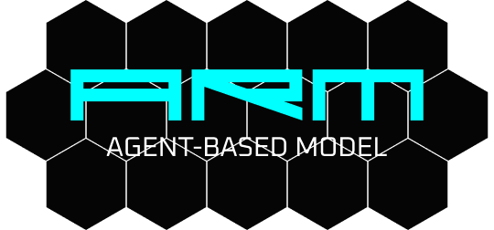

<div align = "center">



# Artificial Ropalidia Marginata Simulation Tool

**Self-Organized Foraging & Food Distribution in *Ropalidia marginata* Wasps.** <br>
**INFO 698 Capstone Project - College of Information Science, University of Arizona.**

[](https://python.org)
[](https://github.com/projectmesa/mesa)
[](https://pygame.org)

A real-time, clean & fast agent-based model of *Ropalidia marginata* wasps. No central controller, no global information — only local rules that reliably produce robust colony-level foraging and food distribution.

</div>

## 🚀 Quick Start

```bash
git clone https://github.com/manasppanse/arm.git
cd arm
pip install -r requirements.txt
python main.py
```
*RECOMMENDED: Create a Virtual Environment BEFORE Installing Requirements.*

Press **START SIM** — Watch a Wasp Colony Perfectly Feed it's Young using Local Heuristics.

## ✨ Core Features

| Feature              | Description                                                                                         |
| -------------------- | --------------------------------------------------------------------------------------------------- |
| Hexagonal Nest Grid  | Procedurally Generated Grid w/ Randomized Placement of Eggs, Larvae, Pupae & Border Cells.   |
| Local Heuristics     | Agent Movement is Purely b.o 6-Cell Perception.                                                     |
| Food Transfer Chain  | Foragers -> Primary Receivers -> Secondary Feeders -> Larvae                                        |
| Real-time Viz        | Smooth Pygame Rendering with Zoom, Hover Info.                                                      |
| Intuitive Controls   | Parameter Sliders for Simulating Multiple Edge Cases.                                               |

## 🧠 Why This Project Matters ?

1. Demonstrates how Simple Local Rules create Robust Collective Behaviour.
2. Completely Faithful to Real Wasp Biology without Over-Engineering.
3. Perfect Tool to Teach Swarm Intelligence, Agent-Based Modelling, etc.

## 🤝 Contributing

If you come across any issues OR have ideas for enhancing existing behaviours, feel free to open an issue or submit a PR. <br>
This project is designed with Extensibility in Mind.

## ⚖️ License

**Apache License 2.0 © 2025** - Manas P Panse